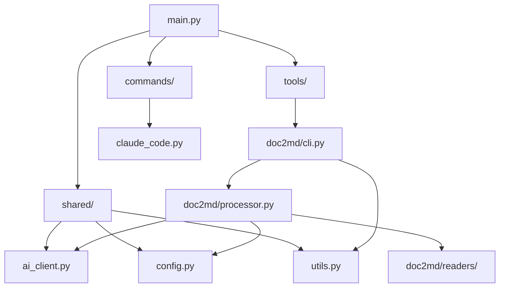

# Claude CLI Tools - 技术实现说明

## 📋 目录

1. [项目概览](#项目概览)
2. [架构设计](#架构设计)
3. [核心模块详解](#核心模块详解)
4. [AI客户端实现](#AI客户端实现)
5. [配置管理系统](#配置管理系统)
6. [文档转换工具](#文档转换工具)
7. [Claude Code集成](#Claude-Code集成)
8. [开发工具链](#开发工具链)
9. [部署和分发](#部署和分发)
10. [扩展指南](#扩展指南)

---

## 项目概览

### 基本信息

- **项目名称**: Claude CLI Tools
- **版本**: 0.1.0
- **Python版本**: 3.11+
- **包管理**: uv (推荐) / pip
- **许可证**: MIT
- **架构**: 模块化CLI工具集合

### 技术栈

| 组件 | 技术选型 | 版本要求 | 用途 |
|------|---------|----------|------|
| CLI框架 | Click + Rich-Click | >= 8.1.0 | 命令行界面构建 |
| UI组件 | Rich | >= 13.8.0 | 终端界面美化 |
| AI客户端 | Pydantic-AI | >= 0.0.14 | AI模型集成 |
| 配置管理 | Pydantic + PyYAML | >= 2.11.0 | 配置验证和持久化 |
| PDF处理 | PyMuPDF + PyMuPDF4LLM | >= 1.26.3 | PDF文档解析 |
| Word处理 | python-docx | >= 1.2.0 | DOCX文档处理 |
| 网络请求 | httpx | >= 0.27.0 | HTTP异步客户端 |

---

## 架构设计

### 总体架构

```
claude-clis/
├── src/claude_clis/
│   ├── main.py                 # 主入口和CLI路由
│   ├── shared/                 # 共享组件
│   │   ├── ai_client.py        # AI客户端抽象层
│   │   ├── config.py           # 配置管理系统
│   │   └── utils.py            # 工具函数库
│   ├── tools/                  # 工具模块
│   │   └── doc2md/             # 文档转换工具
│   │       ├── cli.py          # CLI命令定义
│   │       ├── processor.py    # 核心处理逻辑
│   │       └── readers/        # 文档读取器
│   └── commands/               # 系统命令
│       └── claude_code.py      # Claude Code集成
├── tests/                      # 测试套件
├── pyproject.toml              # 项目配置
└── README.md                   # 项目文档
```

### 设计原则

1. **模块化设计**: 每个工具独立模块，便于维护和扩展
2. **配置驱动**: 通过配置文件和环境变量控制行为
3. **异步优先**: 使用异步编程提升性能
4. **错误处理**: 完整的异常处理和用户友好提示
5. **类型安全**: 完整类型注解，mypy验证

### 依赖关系



---

## 核心模块详解

### 主入口 (main.py)

**文件路径**: `src/claude_clis/main.py`

#### 关键特性

1. **Click框架集成**: 使用rich-click提供美观的CLI界面
2. **全局上下文管理**: CLIContext对象管理verbosity等全局状态
3. **动态命令加载**: 通过`register_tools()`动态注册子命令
4. **配置命令组**: 内置配置管理命令

#### 核心代码结构

```python
@click.group(name="claude-clis")
@click.option("--verbose", "-v", is_flag=True)
@click.option("--quiet", "-q", is_flag=True)
def main(ctx: click.Context, verbose: bool, quiet: bool) -> None:
    cli_ctx = CLIContext()
    cli_ctx.verbose = verbose
    cli_ctx.quiet = quiet
    ctx.obj = cli_ctx
```

#### 配置管理集成

```python
@main.group()
def config(ctx: click.Context) -> None:
    """⚙️ Configuration management"""

@config.command("set")
def config_set(cli_ctx: CLIContext, key: str, value: str) -> None:
    config_manager.set_config_value(key, value)
    cli_ctx.success(f"Set {key} = {value}")
```

### 工具函数库 (utils.py)

**文件路径**: `src/claude_clis/shared/utils.py`

#### 功能模块

1. **Rich UI组件**
   ```python
   def print_info(message: str) -> None:
       console.print(f"[blue]ℹ[/blue] {message}")
   
   def print_table(title: str, columns: list[str], rows: list[list[str]]) -> None:
       table = create_table(title, columns, rows, show_header)
       console.print(table)
   ```

2. **文件处理工具**
   ```python
   def format_file_size(size_bytes: int) -> str:
       # 智能文件大小格式化 (B, KB, MB, GB)
   
   def sanitize_filename(filename: str) -> str:
       # 文件名安全处理，移除特殊字符
   ```

3. **CLI上下文管理**
   ```python
   class CLIContext:
       def __init__(self) -> None:
           self.verbose: bool = False
           self.quiet: bool = False
           self.dry_run: bool = False
       
       def log(self, message: str, level: str = "info") -> None:
           # 统一日志输出管理
   ```

---

## AI客户端实现

### 设计架构

**文件路径**: `src/claude_clis/shared/ai_client.py`

#### 多提供商支持

```python
class AIClient:
    def __init__(self, config_manager: ConfigManager) -> None:
        self._config_manager = config_manager
        self._models: dict[str, Model] = {}  # 模型缓存

    def _get_model(self, provider: str) -> Model:
        if provider == "gemini":
            return GeminiModel(model_name=config["model"], api_key=api_key)
        elif provider == "ollama":
            return OpenAIModel(model_name=config["model"], provider=OllamaProvider())
        elif provider == "anthropic":
            return AnthropicModel(model_name=config["model"], api_key=api_key)
```

#### 异步Agent创建

```python
def create_agent(
    self, 
    provider: str | None = None,
    system_prompt: str | None = None,
    **kwargs: Any
) -> Agent[None, str]:
    provider = provider or self._config_manager.get_ai_provider()
    model = self._get_model(provider)
    
    return Agent(model=model, system_prompt=system_prompt, **kwargs)
```

### 文档处理器

```python
class DocumentProcessor:
    def __init__(self, ai_client: AIClient) -> None:
        self.ai_client = ai_client
    
    async def convert_to_markdown(
        self,
        content: str,
        provider: str | None = None,
        style: str = "technical",
        preserve_formatting: bool = True,
        **kwargs: Any
    ) -> str:
        prompt = self._create_conversion_prompt(content, style, preserve_formatting)
        
        return await self.ai_client.run_prompt(
            prompt=prompt,
            provider=provider,
            system_prompt=SYSTEM_PROMPT,
            **kwargs
        )
```

#### 智能分块处理

```python
def chunk_content(self, content: str, chunk_size: int = 4000) -> list[str]:
    if len(content) <= chunk_size:
        return [content]
    
    chunks = []
    current_pos = 0
    
    while current_pos < len(content):
        end_pos = min(current_pos + chunk_size, len(content))
        
        # 智能断点查找：优先段落边界，其次句子边界
        if end_pos < len(content):
            for i in range(end_pos, max(current_pos + chunk_size // 2, end_pos - 200), -1):
                if content[i:i+2] == "\n\n":  # 段落边界
                    end_pos = i + 2
                    break
```

---

## 配置管理系统

### Pydantic模型定义

**文件路径**: `src/claude_clis/shared/config.py`

#### 分层配置结构

```python
class GeminiConfig(BaseModel):
    api_key: str = ""
    model: str = "gemini-1.5-pro"
    temperature: float = 0.3
    max_tokens: int = 4096

class OllamaConfig(BaseModel):
    base_url: str = "http://localhost:11434"
    model: str = "llama3.2:latest"
    temperature: float = 0.3
    timeout: int = 120

class AnthropicConfig(BaseModel):
    api_key: str = ""
    model: str = "claude-3-sonnet-20240229"
    temperature: float = 0.3
    max_tokens: int = 4096

class AIConfig(BaseModel):
    provider: Literal["gemini", "ollama", "anthropic"] = "gemini"
    gemini: GeminiConfig = Field(default_factory=GeminiConfig)
    ollama: OllamaConfig = Field(default_factory=OllamaConfig)
    anthropic: AnthropicConfig = Field(default_factory=AnthropicConfig)
```

#### 配置管理器

```python
class ConfigManager:
    def __init__(self) -> None:
        self._config_dir = Path.home() / ".claude-clis"
        self._config_file = self._config_dir / "config.yaml"
        self._config: Config | None = None

    def load_config(self) -> Config:
        config_data: dict[str, Any] = {}
        if self._config_file.exists():
            with open(self._config_file, encoding="utf-8") as f:
                config_data = yaml.safe_load(f) or {}
        
        # 结合环境变量和文件配置
        self._config = Config(**config_data)
        return self._config
```

#### 动态配置更新

```python
def set_config_value(self, key: str, value: Any) -> None:
    config = self.load_config()
    
    # 处理嵌套键如 "ai.provider" 或 "ai.gemini.api_key"
    keys = key.split(".")
    target = config
    
    for k in keys[:-1]:
        target = getattr(target, k)
    
    setattr(target, keys[-1], value)
    self.save_config(config)
```

---

## 文档转换工具

### CLI命令定义

**文件路径**: `src/claude_clis/tools/doc2md/cli.py`

#### 命令结构

```python
@click.group(name="doc2md")
def doc2md(ctx: click.Context) -> None:
    """📄 Document to Markdown converter"""

@doc2md.command()
@click.argument("input_file", type=click.Path(exists=True, path_type=Path))
@click.option("-o", "--output", "output_file", type=click.Path(path_type=Path))
@click.option("--ai-provider", type=click.Choice(["gemini", "ollama", "anthropic"]))
@click.option("--style", type=click.Choice(["technical", "academic", "business", "casual"]))
def convert(cli_ctx: CLIContext, input_file: Path, ...):
    """🔄 Convert a single document to Markdown"""
```

#### 批处理支持

```python
@doc2md.command()
@click.argument("input_dir", type=click.Path(exists=True, file_okay=False, path_type=Path))
@click.option("--max-concurrent", type=int, default=3)
def batch(cli_ctx: CLIContext, input_dir: Path, max_concurrent: int, ...):
    """📁 Convert multiple documents in a directory"""
    
    results = asyncio.run(processor.batch_convert(
        input_dir=input_dir,
        max_concurrent=max_concurrent,
        ...
    ))
```

### 核心处理器

**文件路径**: `src/claude_clis/tools/doc2md/processor.py`

#### 处理器架构

```python
class Doc2mdProcessor:
    def __init__(self, cli_ctx: CLIContext) -> None:
        self.cli_ctx = cli_ctx
        self.ai_client = AIClient(config_manager)
        self.doc_processor = DocumentProcessor(self.ai_client)
        
        # 动态初始化文档读取器
        try:
            self.pdf_reader = PDFReader()
        except PDFReaderError as e:
            self.cli_ctx.warning(f"PDF reader unavailable: {e}")
            self.pdf_reader = None
```

#### 异步处理流程

```python
async def convert_file(
    self,
    input_file: Path | str,
    output_file: Path | str | None = None,
    ai_provider: str | None = None,
    **kwargs: Any
) -> Path:
    # 1. 文件验证
    input_path = Path(input_file)
    if not self.is_supported_format(input_path):
        raise ProcessorError(f"Unsupported file format: {input_path.suffix}")
    
    # 2. 内容提取
    content = await self._extract_content(input_path)
    
    # 3. AI处理
    markdown_content = await self.doc_processor.process_large_content(
        content=content,
        provider=ai_provider,
        **kwargs
    )
    
    # 4. 元数据生成和保存
    metadata = self._generate_metadata(input_path, ai_provider, style)
    final_content = f"{metadata}\n\n{markdown_content}"
    
    with open(output_path, 'w', encoding='utf-8') as f:
        f.write(final_content)
```

#### 并发批处理

```python
async def batch_convert(self, max_concurrent: int = 3, **kwargs) -> list[Path]:
    semaphore = asyncio.Semaphore(max_concurrent)
    tasks = []
    
    async def convert_with_semaphore(file: Path) -> Path | None:
        async with semaphore:
            try:
                return await self.convert_file(input_file=file, **kwargs)
            except ProcessorError:
                return None
    
    # 创建并执行任务
    for file in files:
        tasks.append(convert_with_semaphore(file))
    
    results = await asyncio.gather(*tasks, return_exceptions=True)
    return [r for r in results if isinstance(r, Path)]
```

### 文档读取器

#### PDF读取器

**文件路径**: `src/claude_clis/tools/doc2md/readers/pdf.py`

```python
class PDFReader:
    def __init__(self) -> None:
        try:
            import pymupdf4llm
            import fitz  # PyMuPDF
            self.pymupdf4llm = pymupdf4llm
            self.fitz = fitz
        except ImportError as e:
            raise PDFReaderError(f"PDF dependencies not available: {e}")
    
    def read_pdf(self, file_path: Path | str) -> str:
        """使用PyMuPDF4LLM提取PDF内容，针对LLM处理优化"""
        try:
            # 使用pymupdf4llm进行智能文本提取
            md_text = self.pymupdf4llm.to_markdown(str(file_path))
            return md_text
        except Exception as e:
            raise PDFReaderError(f"Failed to read PDF: {e}")
    
    def get_pdf_info(self, file_path: Path | str) -> dict[str, Any]:
        """获取PDF元数据信息"""
        with self.fitz.open(str(file_path)) as doc:
            return {
                'pages': doc.page_count,
                'title': doc.metadata.get('title', ''),
                'author': doc.metadata.get('author', ''),
                'encrypted': doc.needs_pass
            }
```

#### Word读取器

**文件路径**: `src/claude_clis/tools/doc2md/readers/word.py`

```python
class WordReader:
    def __init__(self) -> None:
        try:
            from docx import Document
            self.Document = Document
        except ImportError as e:
            raise WordReaderError(f"Word dependencies not available: {e}")
    
    def read_docx(self, file_path: Path | str) -> str:
        """读取DOCX文档并转换为纯文本"""
        doc = self.Document(str(file_path))
        
        content_parts = []
        
        # 处理段落
        for paragraph in doc.paragraphs:
            if paragraph.text.strip():
                content_parts.append(paragraph.text)
        
        # 处理表格
        for table in doc.tables:
            table_content = self._extract_table_content(table)
            if table_content:
                content_parts.append(table_content)
        
        return '\n\n'.join(content_parts)
```

---

## Claude Code集成

### 集成架构

**文件路径**: `src/claude_clis/commands/claude_code.py`

#### 命令注册系统

```python
def create_claude_command(
    name: str,
    description: str,
    command: str,
    working_dir: str | None = None,
    tags: list[str] | None = None,
) -> dict[str, Any]:
    """创建Claude Code命令配置"""
    return {
        "name": name,
        "description": description,
        "command": command,
        "working_directory": working_dir or ".",
        "tags": tags or [],
        "version": "1.0.0"
    }
```

#### 批量注册功能

```python
@claude_code_cmd.command(name="register")
@click.option("--name", default="claude-clis")
@click.option("--force", is_flag=True)
def register(ctx: CLIContext, name: str, force: bool) -> None:
    # 获取claude-clis可执行文件路径
    claude_clis_path = shutil.which("claude-clis")
    
    # 定义要注册的命令
    commands_to_register = [
        {
            "filename": f"{name}-doc2md",
            "config": create_claude_command(
                name=f"/{name}-doc2md",
                description="Convert documents to Markdown using AI",
                command=f"{claude_clis_path} doc2md convert {{{{prompt}}}}",
                tags=["document", "conversion", "ai", "markdown"]
            )
        },
        # ... 其他命令
    ]
    
    # 批量写入JSON配置文件
    for cmd_info in commands_to_register:
        cmd_file = commands_dir / f"{cmd_info['filename']}.json"
        with open(cmd_file, 'w', encoding='utf-8') as f:
            json.dump(cmd_info['config'], f, indent=2)
```

#### 管理功能

```python
@claude_code_cmd.command(name="list")
def list_commands(ctx: CLIContext, name: str) -> None:
    """列出已注册的命令"""
    commands_dir = get_commands_dir()
    command_files = list(commands_dir.glob(f"{name}-*.json"))
    
    table = Table(title=f"📋 Registered Commands ({name})")
    for cmd_file in sorted(command_files):
        with open(cmd_file, 'r', encoding='utf-8') as f:
            cmd_config = json.load(f)
        
        table.add_row(
            cmd_config.get('name', 'N/A'),
            cmd_config.get('description', 'N/A'),
            ', '.join(cmd_config.get('tags', []))
        )
    
    console.print(table)
```

---

## 开发工具链

### 项目配置

**文件路径**: `pyproject.toml`

#### 构建系统

```toml
[build-system]
requires = ["hatchling"]
build-backend = "hatchling.build"

[project]
name = "claude-clis"
version = "0.1.0"
requires-python = ">=3.11"
dependencies = [
    "click>=8.1.0",
    "rich>=13.8.0",
    "python-docx>=1.2.0",
    "pymupdf>=1.26.3",
    "pydantic-ai>=0.0.14",
    # ... 其他依赖
]
```

#### 开发工具配置

```toml
[tool.black]
line-length = 88
target-version = ['py311']

[tool.ruff]
target-version = "py311"
line-length = 88
select = ["E", "W", "F", "I", "B", "C4", "UP"]

[tool.mypy]
python_version = "3.11"
disallow_untyped_defs = true
disallow_incomplete_defs = true
check_untyped_defs = true
```

#### 测试配置

```toml
[tool.pytest.ini_options]
testpaths = ["tests"]
addopts = [
    "--strict-markers",
    "--strict-config",
    "--cov=claude_clis",
    "--cov-report=term-missing",
    "--cov-report=html",
    "--cov-fail-under=80",
]
```

### 质量保证

#### 代码格式化
```bash
# 代码格式化
uv run black src/
uv run ruff check src/ --fix

# 类型检查
uv run mypy src/
```

#### 测试覆盖
```bash
# 运行测试套件
uv run pytest

# 生成覆盖率报告
uv run pytest --cov=claude_clis --cov-report=html
```

---

## 部署和分发

### 安装方式

#### pipx 安装（推荐）
```bash
# 安装 pipx（如果尚未安装）
pip install pipx
pipx ensurepath

# 从 PyPI 安装（发布后）
pipx install claude-clis

# 或从 GitHub 直接安装
pipx install git+https://github.com/your-username/claude-clis.git

# 升级和卸载
pipx upgrade claude-clis
pipx uninstall claude-clis
```

**pipx 优势：**
- 🔒 **环境隔离**: 每个工具在独立虚拟环境中运行
- 🌐 **全局可用**: 命令在系统范围内可访问  
- 🚀 **易于管理**: 简单的升级和卸载流程
- 🎯 **专为 CLI 设计**: 专门针对命令行工具优化

#### 开发安装
```bash
# 克隆仓库
git clone https://github.com/your-username/claude-clis.git
cd claude-clis

# 开发模式安装
uv pip install -e .
```

#### 其他安装方式
```bash
# 使用 uv
uv add claude-clis

# 使用 pip  
pip install claude-clis

# 从源码安装
pip install git+https://github.com/your-username/claude-clis.git
```

### 安装方式对比

| 方式 | 适用场景 | 优点 | 缺点 |
|------|---------|------|------|
| **pipx** | 终端用户 | 环境隔离、全局命令、易管理 | 需要额外安装 pipx |
| **uv** | 开发者 | 快速、现代化包管理 | 相对较新 |
| **pip** | 传统使用 | 广泛支持、无需额外工具 | 可能有依赖冲突 |

### 入口点配置

```toml
[project.scripts]
claude-clis = "claude_clis.main:main"
```

### 可选依赖

```toml
[project.optional-dependencies]
dev = [
    "pytest>=8.0",
    "mypy>=1.11",
    "black>=24.0",
    "ruff>=0.6.0",
    "pytest-cov>=5.0",
]
doc2md = [
    "python-docx>=1.2.0",
    "pymupdf>=1.26.3",
    "pymupdf4llm",
]
```

---

## 扩展指南

### 添加新工具

#### 1. 创建工具模块

```bash
mkdir -p src/claude_clis/tools/newtool
touch src/claude_clis/tools/newtool/__init__.py
touch src/claude_clis/tools/newtool/cli.py
touch src/claude_clis/tools/newtool/processor.py
```

#### 2. 实现CLI接口

```python
# src/claude_clis/tools/newtool/cli.py
import click
from ...shared.utils import CLIContext

@click.group(name="newtool")
def newtool() -> None:
    """🔧 New tool description"""
    pass

@newtool.command()
@click.argument("input_param")
@click.pass_obj
def process(cli_ctx: CLIContext, input_param: str) -> None:
    """Process something"""
    # 实现逻辑
    pass
```

#### 3. 注册到主CLI

```python
# src/claude_clis/main.py
def register_tools() -> None:
    try:
        from .tools.newtool.cli import newtool
        main.add_command(newtool)
    except ImportError as e:
        print_error(f"Failed to load newtool: {e}")
```

### 添加新AI提供商

#### 1. 扩展配置模型

```python
# src/claude_clis/shared/config.py
class NewProviderConfig(BaseModel):
    api_key: str = ""
    model: str = "default-model"
    base_url: str = "https://api.newprovider.com"

class AIConfig(BaseModel):
    provider: Literal["gemini", "ollama", "anthropic", "newprovider"] = "gemini"
    newprovider: NewProviderConfig = Field(default_factory=NewProviderConfig)
```

#### 2. 实现AI客户端

```python
# src/claude_clis/shared/ai_client.py
def _get_model(self, provider: str) -> Model:
    if provider == "newprovider":
        config = self._config_manager.get_ai_config(provider)
        return CustomModel(
            model_name=config["model"],
            api_key=config["api_key"],
            base_url=config["base_url"]
        )
```

### 添加新文档格式

#### 1. 创建读取器

```python
# src/claude_clis/tools/doc2md/readers/newformat.py
class NewFormatReader:
    def __init__(self) -> None:
        try:
            import required_library
            self.lib = required_library
        except ImportError as e:
            raise NewFormatReaderError(f"Dependencies not available: {e}")
    
    def read_document(self, file_path: Path | str) -> str:
        # 实现文档读取逻辑
        pass
```

#### 2. 集成到处理器

```python
# src/claude_clis/tools/doc2md/processor.py
def __init__(self, cli_ctx: CLIContext) -> None:
    # ... 现有初始化代码
    
    try:
        from .readers.newformat import NewFormatReader
        self.newformat_reader = NewFormatReader()
    except Exception as e:
        self.cli_ctx.warning(f"New format reader unavailable: {e}")
        self.newformat_reader = None

def get_supported_formats(self) -> list[str]:
    formats = []
    # ... 现有格式
    if self.newformat_reader:
        formats.extend(['.newext'])
    return formats
```

---

## 性能优化建议

### 1. 异步处理优化

- 使用`asyncio.Semaphore`控制并发数
- 实现智能分块减少内存使用
- 缓存AI模型实例避免重复初始化

### 2. 错误处理最佳实践

- 分层异常处理：业务异常 vs 系统异常
- 用户友好的错误消息
- 详细的调试信息（verbose模式）

### 3. 配置管理优化

- 延迟加载配置文件
- 环境变量优先级管理
- 配置验证和默认值处理

### 4. 内存管理

- 流式处理大文件
- 及时释放临时资源
- 智能分块避免内存溢出

---

## 技术债务和改进方向

### 当前限制

1. **同步文档读取**: PDF和Word读取器目前是同步的
2. **有限的格式支持**: 仅支持主流文档格式
3. **简单的错误重试**: 缺乏智能重试机制
4. **配置热重载**: 配置更改需要重启应用

### 改进计划

1. **异步文档处理**: 实现完全异步的文档读取
2. **插件系统**: 支持第三方工具和格式扩展
3. **进度跟踪**: 长时间操作的实时进度显示
4. **缓存系统**: 智能缓存AI处理结果
5. **配置GUI**: 图形化配置管理界面

---

*本文档由 Claude CLI Tools 开发团队维护，最后更新：{{ current_date }}*